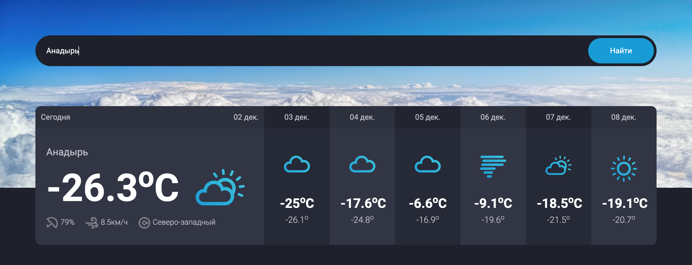

# Weather 



Веб-приложение для просмотра текущей погоды с возможностью выбора города. Простой и интуитивный интерфейс, актуальные данные в реальном времени.

## Пример использования

- Пользователь заходит на сайт
- В поисковой строке вводит название города
- Приложение отображает текущую погоду: температуру, ощущаемую температуру, влажность, давление, скорость ветра, облачность и иконку погоды
- При повторном поиске — данные обновляются без перезагрузки страницы

## Стек технологий

- **Frontend**: React, Vite
- **Backend**: Node.js, Express  
- **API**: open-meteo.com

## Внешние сервисы / интеграции

- **open-meteo.com

## Установка

**Требования**:
- Node.js 18+ (рекомендуется 20+)
- npm или pnpm

Клонировать репозиторий и установить зависимости:

```bash
git clone <репозиторий>
cd <репозиторий>
npm install
